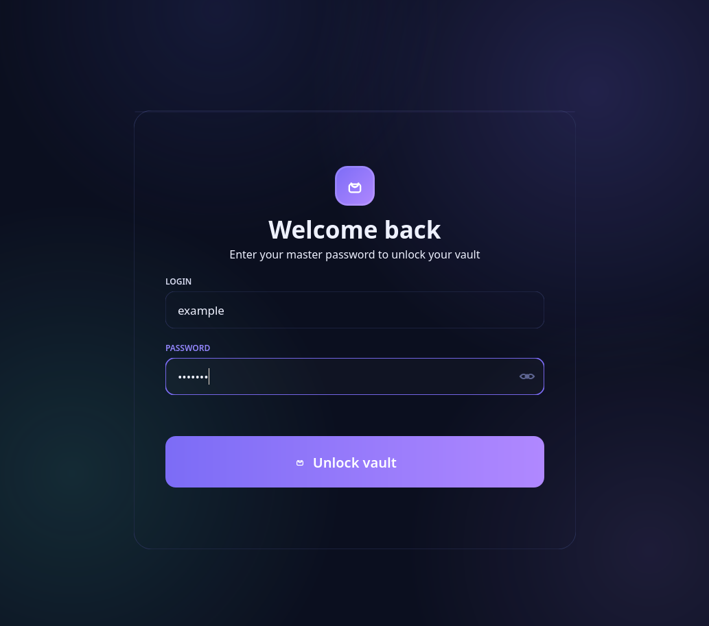
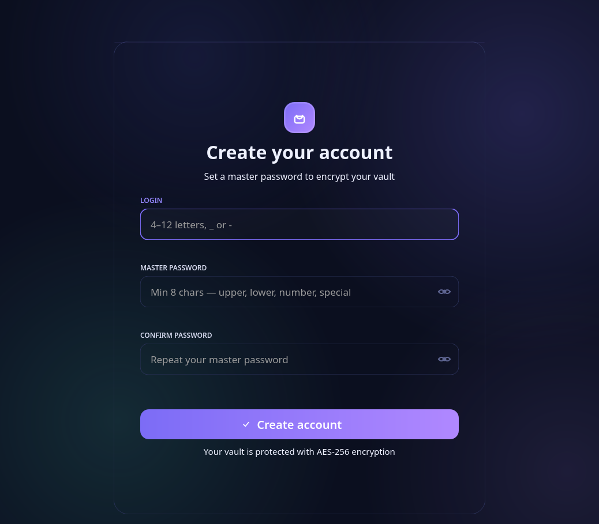
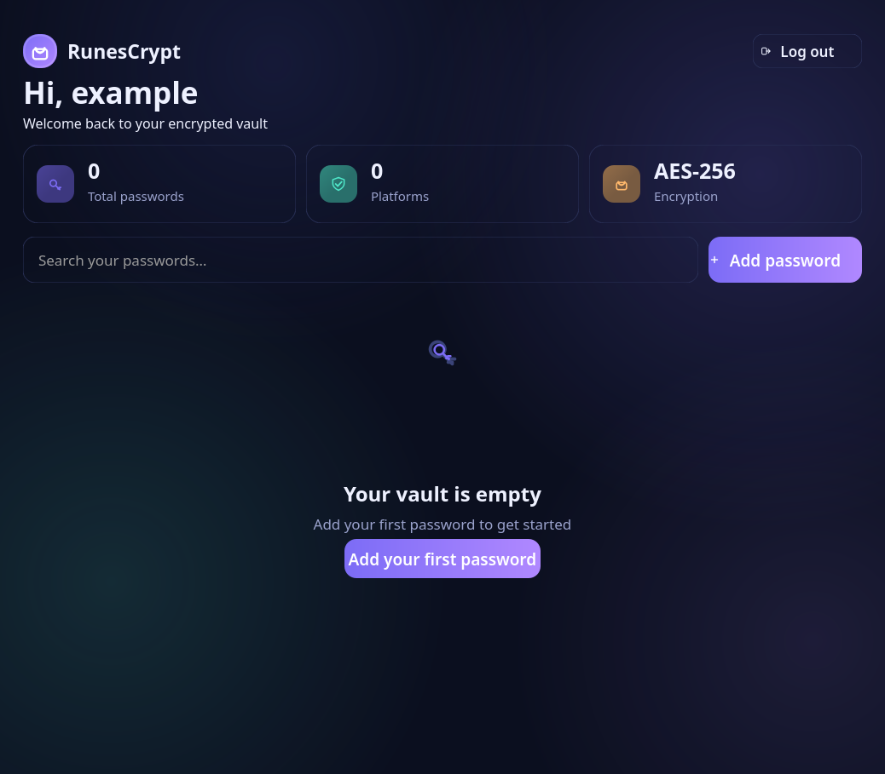
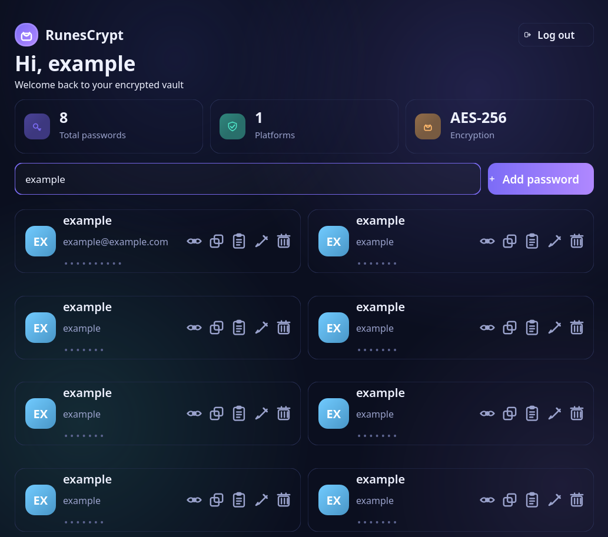
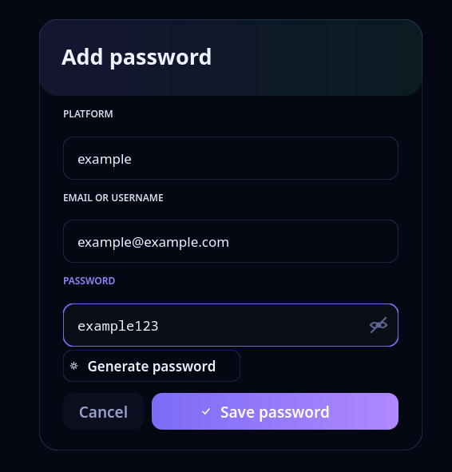
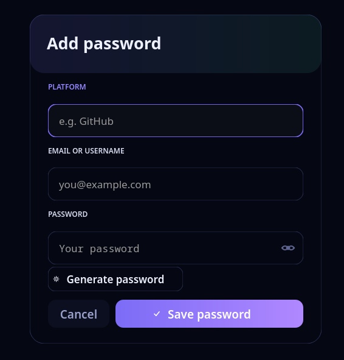

# RunesCrypt

<div align="center">
  
</div>

<div align="center">

   

</div>

RunesCrypt is a desktop password manager that combines a manual implementation of AES-256 encryption with a manual SHA-256 hashing pipeline to protect stored credentials. The project is designed not only as a usable vault for personal secrets, but also as a clear educational reference for understanding how modern cryptographic primitives work at a low level.

> This project was built with a strong emphasis on readability, transparency, and learning. Instead of relying on high-level cryptography libraries for the core logic, the implementation walks through each transformation explicitly so that students, developers, and security enthusiasts can follow the process step by step.

---

## Table of Contents

- [Project Overview](#project-overview)
- [Features](#features)
- [Screenshots](#screenshots)
- [Project Structure](#project-structure)
- [Cryptographic Algorithms](#cryptographic-algorithms)
- [Encryption Workflow](#encryption-workflow)
- [Decryption Workflow](#decryption-workflow)
- [Examples](#examples)
- [Installation](#installation)
- [Usage](#usage)
- [Security Notes](#security-notes)
- [Educational Goals](#educational-goals)
- [Future Improvements](#future-improvements)
- [License](#license)

---

## Project Overview

RunesCrypt is a locally managed password vault with a polished graphical interface and a strong cryptographic core. It allows users to create an account, log in, and store platform credentials such as email addresses and passwords inside an encrypted vault.

At the heart of the project are two custom implementations:

- A manual SHA-256 hashing routine used to derive a master key and to hash login credentials.
- A manual AES-256 encryption routine used to encrypt stored values before they are written to disk.

The application does not store passwords in plaintext. Instead, the master password is hashed, the resulting value is used as the input for the AES key schedule, and credential values are encrypted before persistence.

The project’s purpose is both practical and educational. It demonstrates how foundational cryptographic building blocks can be implemented from first principles, without hiding the internals behind library abstraction.

---

## Features

RunesCrypt includes the following capabilities:

- AES-256 encryption for stored credentials
- SHA-256 hashing for account validation and key derivation
- Manual AES implementation with explicit round operations
- Manual SHA-256 implementation with bitwise processing
- Secure credential storage in JSON files
- User account creation and authentication
- Password vault management with add, edit, delete, and search workflows
- Encrypted password and email storage
- Modern PyQt5-based desktop UI with polished interactions
- Account management and logout flow

---

## Screenshots

The following screenshots showcase the interface and the user experience of the application.

### Login Screen



A clean authentication screen where users unlock their vault using their master password.

### Account Creation



The onboarding experience for setting up a new account and master password.

### Main Dashboard



The main vault view with a modern dashboard layout and encrypted credential overview.

### Password Management View



This view highlights how stored credentials appear within the vault after decryption.

### Add Password Modal



A focused modal used to add new platform credentials to the vault.

### Empty Vault State



The empty state displayed when no credentials have been stored yet.

---

## Project Structure

The repository is organized around a small but clearly separated architecture.

```text
RunesCrypt/
├── algos/
│   ├── encrypt_aes_256/
│   │   ├── aes_256.py
│   │   ├── aes_256_utils.py
│   │   ├── encryption_process_utils.py
│   │   └── key_expansion.py
│   ├── decrypt_aes_256/
│   │   ├── decrypt_aes_256.py
│   │   ├── decrypt_aes_256_utils.py
│   │   └── gmul.py
│   └── hashing_sha_256/
│       ├── operations.py
│       ├── sha_256.py
│       └── sha_256_utils.py
├── UI/
│   ├── app.py
│   ├── fx.py
│   ├── services.py
│   ├── theme.py
│   ├── widgets.py
│   ├── screens/
│   └── __main__.py
├── validat_data/
│   └── validator.py
├── img/
└── readme_imgs/
```

### Key directories and modules

- `algos/encrypt_aes_256/`: Contains the AES-256 encryption implementation, including matrix creation, round-key expansion, and the core AES round functions.
- `algos/decrypt_aes_256/`: Contains the inverse AES operations used to decrypt stored values.
- `algos/hashing_sha_256/`: Contains the SHA-256 implementation, including padding, message schedule generation, and compression logic.
- `UI/`: Houses the PyQt5 desktop application, the animated UI components, authentication screens, dashboard, and the modal-driven password management flow.
- `UI/services.py`: Connects the UI to the cryptography layer and manages vault persistence.
- `validat_data/validator.py`: Validates login and password constraints before creating or authenticating users.

---

## Cryptographic Algorithms

This is the core of the project, and it deserves special attention.

### SHA-256

The SHA-256 implementation in this project is a manual, bit-oriented version of the standard algorithm. It does not rely on a cryptography library for hashing. Instead, it processes the input text as a binary stream and applies the standard SHA-256 flow:

1. Convert the message into bits.
2. Append the mandatory padding bit.
3. Extend the message to the required length.
4. Split the data into 512-bit blocks.
5. Generate the message schedule words.
6. Run the 64 rounds of the compression function.

The implementation is intentionally explicit. The code works with binary strings, right rotations, right shifts, XOR operations, and the SHA-256 round constants. This makes the hashing process easy to inspect and easier to learn.

### AES-256

The AES-256 implementation follows the same philosophy. The encryption logic is implemented manually rather than delegated to external libraries. The process starts by converting the plaintext into a 4x4 state matrix, then applying the AES rounds one by one.

The implementation uses a string-based representation of bytes and bits rather than native integer-based byte handling. Each byte is handled as a binary string of length 8, and transformations are performed with explicit XOR and bit operations.

### Why binary strings are used

A defining characteristic of this implementation is that it uses binary strings instead of integers, bytes, or hexadecimal arithmetic. This was a deliberate choice.

This design increases computational complexity compared to a high-performance implementation using native byte arrays, but that trade-off was made on purpose because:

- Every bit transformation becomes visible.
- The code is easier to read for educational purposes.
- Debugging becomes significantly easier.
- Students can follow each AES round line by line.
- Every XOR operation is explicit.
- The implementation prioritizes understanding over speed.

In short, this project values clarity and pedagogy over performance. It is an educational implementation of AES-256, not an optimized production-grade cryptography engine.

### Key Expansion

The AES key schedule is built manually in the key expansion module. The original key is transformed into round keys for every stage of the encryption process. Each round uses a different round key derived from the previous one.

This implementation builds round keys through:

- Word expansion
- RotWord behavior
- SubWord behavior
- XOR-based combination with round constants

These round keys are used in the AddRoundKey steps during encryption and decryption.

### Round Keys

Round keys are the values XORed with the state matrix at each encryption or decryption stage. The project generates them explicitly and stores them in a structured list so each round can be applied in sequence.

### AddRoundKey

AddRoundKey is the first and final transformation used in each AES round. It XORs the current state with the corresponding round key. In this implementation, the operation is expressed clearly using the project’s custom XOR helper.

### SubBytes

SubBytes substitutes each byte in the state using the AES S-box lookup table. In this implementation, each byte is transformed through a table-driven substitution step that mimics the standard AES behavior.

### ShiftRows

ShiftRows rotates the rows of the state matrix. The first row remains unchanged, while the second, third, and fourth rows are shifted by different offsets. This diffusion step is implemented explicitly.

### MixColumns

MixColumns mixes bytes across columns using the AES multiplication over the finite field $GF(2^8)$. This implementation performs the operation using custom multiplication helpers such as `gmul2`, `gmul3`, and related inverse forms for decryption.

### Final Round

The AES process ends with a final round that omits MixColumns. In this codebase, the encryption pipeline applies the standard rounds from 1 through 13 with MixColumns, then performs a last round with SubBytes, ShiftRows, and AddRoundKey.

### AES Decryption

Decryption follows the reverse of encryption:

- AddRoundKey with the last round key
- Inverse ShiftRows
- Inverse SubBytes
- AddRoundKey with the next round key
- Inverse MixColumns

This reverse process is implemented separately in the decryption modules and is designed to match the encryption flow exactly.

### Password Hashing

The password hashing path uses SHA-256 in a straightforward but transparent way. The login values and the master password are hashed before any comparison or derivation step. The service layer then uses the SHA-256 result to derive the AES key used for encryption and decryption.

---

## Encryption Workflow

The encryption flow in this project can be understood as a sequence of transformations applied to the plaintext.

```text
Plain Text
   ↓
State Matrix
   ↓
AddRoundKey
   ↓
SubBytes
   ↓
ShiftRows
   ↓
MixColumns
   ↓
AddRoundKey
   ↓
...
   ↓
Ciphertext
```

In the actual implementation:

1. The plaintext is converted into a state matrix.
2. The initial key is expanded into round keys.
3. The first round key is applied with AddRoundKey.
4. SubBytes substitutes bytes using the AES S-box.
5. ShiftRows permutes the rows.
6. MixColumns mixes data across columns.
7. The next round key is applied.
8. The process repeats for the AES rounds.
9. The final round produces the ciphertext.

---

## Decryption Workflow

The decryption workflow is the inverse of encryption and is implemented explicitly.

```text
Ciphertext
   ↓
AddRoundKey
   ↓
Inverse ShiftRows
   ↓
Inverse SubBytes
   ↓
Inverse MixColumns
   ↓
AddRoundKey
   ↓
...
   ↓
Plain Text
```

In practice, the decryption modules reverse the transformations and use the corresponding inverse operations to reconstruct the original text.

---

## Examples

Here are a few illustrative examples based on the project’s behavior.

### Example plaintext

```text
Hello World
```

### Example encrypted value

```text
8b2d6f0ab94...
```

The exact ciphertext varies depending on the key, the padding behavior, and the internal state transformations.

### Example password

```text
myPassword123
```

### Example SHA-256 hash

```text
ef92b778bafe771e89245b89ecbc...
```

### Example stored vault structure

```json
{
  "platform name": "Instagram",
  "email or user name": "<encrypted_email>",
  "password": "<encrypted_password>"
}
```

Credentials remain encrypted in the vault while the login password is hashed before being used to derive the AES key.

---

## Installation

### Requirements

- Python 3.10+
- PyQt5

### Clone the repository

```bash
git clone https://github.com/your-username/RunesCrypt.git
cd RunesCrypt
```

### Install dependencies

```bash
pip install PyQt5
```

### Run the application

```bash
python -m UI
```

If you are using a virtual environment, activate it first and then run the same command.

---

## Usage

### 1. Create an account

On first launch, the application guides you through account creation. You define a login and a strong master password.

### 2. Log in

After account creation, you can sign in using your login and master password.

### 3. Add credentials

Use the interface to add a new entry for a service such as GitHub, Gmail, or a bank portal.

### 4. Save credentials

The application encrypts the username and password before storing them in the vault file.

### 5. Read credentials

When you log in again, the vault is decrypted and displayed in the dashboard.

### 6. Logout

The session can be safely closed, and the vault remains protected until the correct credentials are provided again.

---

## Security Notes

Please keep the following in mind:

- Passwords are never stored in plaintext.
- SHA-256 is used to hash login credentials and derive the AES key material.
- Stored credentials remain encrypted until the correct password unlocks them.
- Data can only be decrypted successfully with the correct master password.
- This project is educational and should not be treated as a full production-grade security product without further hardening.

> The implementation is intentionally transparent and instructional. It is excellent for understanding the mechanics of cryptography, but it should be treated as a learning-oriented prototype rather than a drop-in enterprise security solution.

---

## Educational Goals

This project was built not only as a password manager, but also as an educational implementation of modern cryptography.

It was designed to help users understand:

- How AES-256 works round by round
- How key expansion generates round keys
- How SHA-256 processes data and padding
- How encryption and decryption differ structurally
- Why explicit bit-level implementations are valuable for learning

The educational value of the project comes from its transparency. Every transformation is visible, every XOR is explicit, and every round can be followed manually.

---

## Future Improvements

The current version already demonstrates the core concepts clearly, but there are many ways to improve it further:

- Add random IV support
- Implement CBC or GCM-style modes
- Add a password generator
- Add full-text search across vault entries
- Add password strength evaluation
- Support import and export of vault data
- Improve vault organization and categorization
- Add cross-platform packaging and improved installation flow

---

## License

This project is licensed under the MIT License.

```text
MIT License

Copyright (c) 2026 RunesCrypt

Permission is hereby granted, free of charge, to any person obtaining a copy
of this software and associated documentation files (the "Software"), to deal
in the Software without restriction, including without limitation the rights
to use, copy, modify, merge, publish, distribute, sublicense, and/or sell
copies of the Software, and to permit persons to whom the Software is
furnished to do so, subject to the following conditions:

The above copyright notice and this permission notice shall be included in all
copies or substantial portions of the Software.

THE SOFTWARE IS PROVIDED "AS IS", WITHOUT WARRANTY OF ANY KIND, EXPRESS OR
IMPLIED, INCLUDING BUT NOT LIMITED TO THE WARRANTIES OF MERCHANTABILITY,
FITNESS FOR A PARTICULAR PURPOSE AND NONINFRINGEMENT. INFRINGEMENT. IN NO EVENT
SHALL THE AUTHORS OR COPYRIGHT HOLDERS BE LIABLE FOR ANY CLAIM, DAMAGES OR
OTHER LIABILITY, WHETHER IN AN ACTION OF CONTRACT, TORT OR OTHERWISE, ARISING
FROM, OUT OF OR IN CONNECTION WITH THE SOFTWARE OR THE USE OR OTHER DEALINGS
IN THE SOFTWARE.
```

---

If you are interested in the cryptographic internals, the AES and SHA-256 implementations are the most important parts of the project. They are where the educational value of RunesCrypt really shines.
